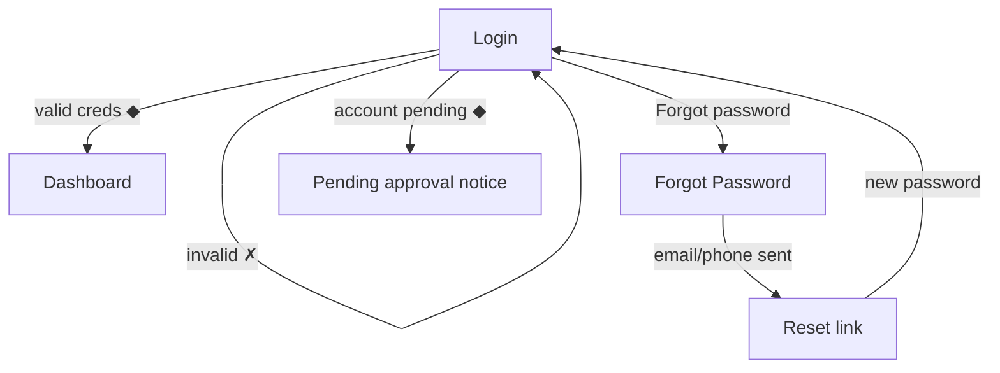
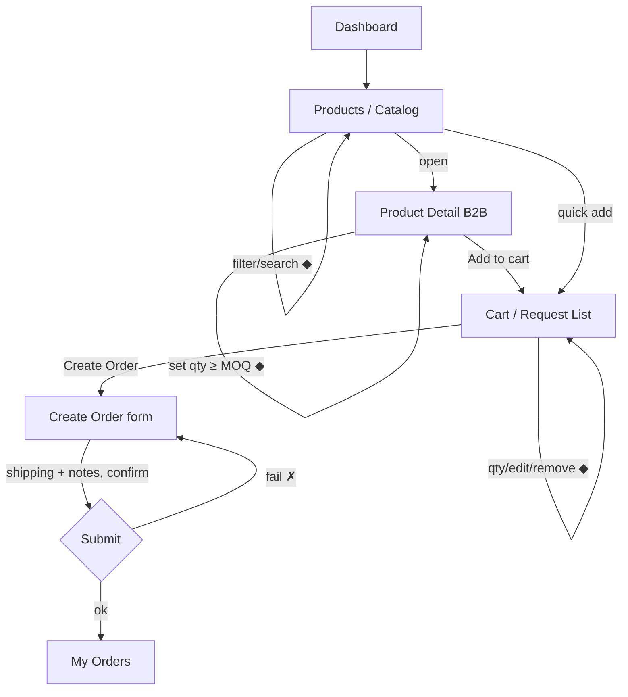

# Violet · User Flows

End-to-end journeys for both products. Each flow lists **actor, preconditions,
happy path, decision/branch points, error branches, postconditions, and the
analytics events** to emit (GA4 + Hotjar — required by the brief).

Legend: `▸` step · `◆` decision · `✗` error branch · `⚐` analytics event.
Screen names match `Site Map` in the requirements.

---

## Part A — Reference Site (EN / RU / AR)

Actors: **Visitor** (public — distributor, partner, retail-curious). No login on the site.

### F-A1 · Discover New Models
**Goal:** a visitor sees what's new and reaches a product.
**Pre:** none.

```mermaid
flowchart TD
  H[Home] -->|Hero CTA "View New Models"| NM[New Models]
  H -->|Highlight grid card| PDP[Product Details]
  NM -->|apply quick filter ◆| NM
  NM -->|click card| PDP
  PDP -->|gallery zoom / swipe| PDP
  PDP -->|Similar products| PDP
  PDP -->|Contact / Find dealer| C[Contact]
  PDP -->|Download catalog PDF| DL[(PDF)]
```

▸ Home loads (hero = New Season/New Models) → ⚐ `page_view{page:home}`
▸ Visitor clicks **View New Models** → New Models list → ⚐ `view_new_models`
◆ Filters (Gender, Strap, Color, Movement, Water-resistance) update grid via **AJAX, no refresh** → ⚐ `filter_apply{facet,value}` (Hotjar: funnel step)
▸ Click a card → PDP → ⚐ `view_item{sku,model,is_new:true}`
▸ Zoom/swipe gallery, read specs → ⚐ `pdp_gallery_interact`
◆ Visitor wants a unit → **Contact / Find dealer** (site has **no cart/checkout** — out of scope) → F-A5
✗ No results after filtering → empty state with "Clear filters" (see screen-states)
✗ Image fails to load → placeholder + alt text; spec content still readable
**Post:** visitor has model code/SKU and a contact path.

### F-A2 · Browse full catalog
**Goal:** find a specific model among 1000+.

▸ Home/nav → **Products** (catalog) → ⚐ `view_catalog`
▸ Two-column: filter panel (start side) + product grid (4/3/2/1 cols per breakpoint)
◆ Combine filters + **Sort** (Newest / A–Z) → grid updates via AJAX, result count announced (live region) → ⚐ `catalog_filter`, `catalog_sort`
◆ **Pagination or Load More** to traverse the set (pattern per trade-offs log) → ⚐ `catalog_paginate{page}`
▸ Hover a card → second image + quick-view → ⚐ `card_hover_quickview`
▸ Click → PDP → **Breadcrumb** `Home › Products › {Model}`
▸ PDP **Similar products** → lateral browse (loops to PDP) → ⚐ `similar_click`
✗ Filter combination yields 0 → empty state suggests relaxing the last facet
✗ Slow network → skeletons hold grid shape; no layout shift
**Post:** visitor reaches the right PDP; SEO/breadcrumb intact.

### F-A3 · Explore the brand
▸ Nav → **About Violet** → sub-sections: Story, History, Quality & Craftsmanship,
Vision & Values, Technologies/Features → ⚐ `view_brand{section}`
▸ CTA "Explore products" → F-A2. CTA "Contact" → F-A5.
**Post:** brand trust established; routed onward.

### F-A4 · Switch language (cross-cutting)
**Pre:** on any page.
▸ Open **Language Selector** (EN/RU/AR) → choose language → ⚐ `language_switch{from,to}`
▸ App sets `<html lang dir>`, swaps font, loads localized content, **stays on the same
page/product**, updates `hreflang`/URL.
◆ If AR → layout flips to **RTL** (mirrored nav, breadcrumb, PDP columns).
✗ Localized content missing for a field → fall back to default language for that field
only (never a blank); log content gap for the CMS team.
**Post:** same context, new locale; bookmarkable localized URL.

### F-A5 · Contact / find a dealer
▸ **Contact** → form (name, company, country, message) → validate → submit →
⚐ `contact_submit` → success confirmation.
✗ Validation error → inline field messages, focus first error.
✗ Submit fails (network/server) → non-blaming banner + retry; preserve entered data.
**Post:** inquiry recorded; visitor sees confirmation + alternate contact info.

---

## Part B — B2B Order App (Persian, RTL)

Actors: **Wholesale customer** (dealer) and **Admin / Sales manager**.

### F-B1 · Authentication

▸ Login (username/password) → ◆ valid → Dashboard → ⚐ `login_success`
✗ Invalid creds → error under form, no field-specific leak ("invalid username or password")
◆ Account not yet **approved by admin** → "pending approval" screen (cannot order) — accounts are admin-created/approved per requirements
▸ Forgot password → request → reset → back to Login → ⚐ `password_reset`
✗ Too many attempts → rate-limit message + cooldown
**Post:** authenticated dealer at Dashboard, or blocked with a clear reason.

### F-B2 · Place a wholesale order (core flow)
**Pre:** logged-in, approved dealer.

▸ Dashboard → **Products** (wholesale price, **MOQ**, stock/availability) → ⚐ `view_catalog_b2b`
◆ Search/filter (like the site, but data is wholesale) → ⚐ `catalog_filter`
▸ Open PDP → specs + wholesale price + **quantity stepper**
◆ Quantity **must ≥ MOQ** → below MOQ disables "Add"/"Submit" with "Minimum N units"
▸ Add to cart → ⚐ `add_to_cart{sku,qty}` (Hotjar funnel) → toast confirm
▸ **Cart / Request List**: edit quantities, line notes, running subtotal (volume
discount hook present but **disabled** for now)
▸ **Create Order**: shipping method, order notes → review → **Submit**
◆ Submit ok → order = **Submitted** → redirect **My Orders** → ⚐ `order_submit{order_id,items,total}`
✗ An item went out of stock / price changed between cart and submit → conflict banner
listing affected lines; let dealer adjust then resubmit (don't silently change)
✗ Network failure on submit → keep cart intact, show retry; never double-submit (idempotency key)
**Post:** order created in **Submitted** state; dealer can track it.

### F-B3 · Track an order & get documents
▸ Dashboard (recent orders + last status) or **My Orders** list → open **Order detail**
→ ⚐ `view_order{order_id}`
▸ **Timeline:** Submitted → Reviewing → Approved → Shipped → Completed (or **Rejected**),
each event timestamped (Hotjar: where dealers drop off)
▸ Download **proforma / invoice** (PDF) from Documents → ⚐ `download_invoice`
✗ Document not yet generated (e.g., before Approved) → disabled with "available after approval"
✗ Order rejected → reason shown + "contact sales" CTA → F-B5
**Post:** dealer knows status; has documents when entitled.

### F-B4 · Account & profile
▸ Profile/Settings → edit company info, contact, password, language → save → ⚐ `profile_update`
✗ Validation/permission error → inline messages; sensitive changes may need re-auth.

### F-B5 · Support / messaging
▸ Support/Messages → thread with sales team (internal messaging) → send → ⚐ `support_message_send`
▸ Admin can also push status messages to dealers (e.g., approval/rejection).
**Post:** two-way contact recorded against the account/order.

---

## Part B (Admin) — Sales/content management

### F-ADM1 · Approve / create wholesale users
▸ Admin Panel → Users → create or review pending → approve/reject → ⚐ `admin_user_approve`
✗ Duplicate company/contact → warn before creating.

### F-ADM2 · Manage products & pricing
▸ Admin → Products → add/edit/delete; manage **images (upload/reorder/delete)**, set
**MOQ**, wholesale price, active/inactive, category/menu → save → ⚐ `admin_product_save`
✗ Missing required spec/image on publish → block with checklist of what's missing.
✗ Deleting a product referenced by open orders → soft-delete/deactivate instead of hard delete.

### F-ADM3 · Manage site content (CMS, 3 languages)
▸ Admin/CMS → edit Home banners & campaigns, categories & menu, static pages
(About/Contact), per-language content (EN/RU/AR from one panel) → publish → ⚐ `cms_publish`
✗ A language left empty on publish → warn; fall back to default per F-A4.

### F-ADM4 · Review orders & report
▸ Admin → Orders → filter/search → open → **change status** (drives F-B3 timeline +
notifies dealer) → ⚐ `admin_order_status{from,to}`
▸ Reports → date range, popular models, order volume → **export CSV/Excel** → ⚐ `admin_export`
✗ Invalid status transition (e.g., Completed → Submitted) → blocked; only forward/Reject allowed.

---

## Cross-product consistency
Both systems must keep the **same product-data shape** (model, SKU, attributes,
images) and **brand visual language** even though they're not technically coupled.
A model's identity (name, code, key specs) reads identically on the site and in the app.

## Analytics taxonomy (GA4 + Hotjar) — summary
- **Site:** `page_view`, `view_new_models`, `view_item`, `filter_apply`, `catalog_sort`,
  `catalog_paginate`, `similar_click`, `language_switch`, `contact_submit`.
- **App:** `login_success`, `view_catalog_b2b`, `add_to_cart`, `order_submit`,
  `view_order`, `download_invoice`, `support_message_send`.
- **Hotjar overlays:** session recording, click/scroll/move heatmaps, funnel analysis
  (catalog→PDP→cart→order), form analysis (login, create-order), on-site survey,
  feedback widget, rage-click/exit detection on high-drop pages.
